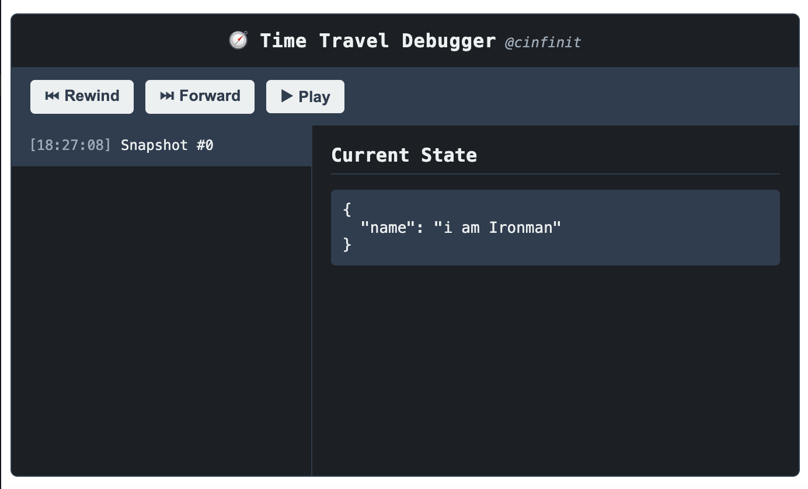

# 🧭 Time Travel Debugger [](https://www.npmjs.com/package/time-travel-debugger) [](https://npmjs.org/package/time-travel-debugger)

Ever wanted to go *back in time* and see what your React state was thinking?

Debugging state in React is hard, especially when it feels like **you’re stuck in a loop**. But what if I told you there was a way to travel through time and space… without the **Back to the Future** complications?

With **Time Travel Debugger**, rewind, fast-forward, and pause your app’s state like you’re a time-traveling wizard — without the need for flux capacitors, hoverboards, or DeLoreans(gem though ;). 🌌

Fix bugs at the speed of thought (and a little bit of code)!
In Simple terms , 
`time-travel-debugger` is a lightweight, component-level state debugger that tracks your `useState` evolution and lets you replay your app’s history like it's the Matrix 🎬.

---

## 🚀 Features

✅ Time-travel through state updates  
✅ Component-local, no global state needed  
✅ Timeline debugger UI with snapshot diffs  
✅ Real-time playback & jump-to-snapshot  
✅ Composite state tracking  
✅ Auto-debug any `useState` 
✅ Minimal, aesthetic UI (Dark-mode devs, rejoice 🖤)

## 📦 Installation

```bash
npm install time-travel-debugger
```

## 📝 Usage
1. Wrap your app (or part of it) with `TimeTravelProvider`
```jsx
import { TimeTravelProvider, TimeTravelDebugger } from 'time-travel-debugger';

function App() {
  return (
    <TimeTravelProvider>
      <YourApp />
      <TimeTravelDebugger />
    </TimeTravelProvider>
  );
}
```


## Two ways to Spy on your own state like it’s Mission Impossible 🕵️‍♂️

1. Use `useTimeTravelState` hook to debug any `useState`
```jsx
useTimeTravelState(key, initialValue)
```

```jsx
import { useTimeTravelState } from 'time-travel-debugger';

function YourComponent() {
  const [count, setCount] = useState(0);

  const [count, setCount] = useTimeTravelState('count', 0);

  return (
    <div>
      <p>Count: {count}</p>
      <button onClick={() => setCount(count + 1)}>Increment</button>
    </div>
  );
}
```
With this you can simulate the state changes and see the changes in the UI as well.

2. Use `useAutoTimeTravelDebugger` hook to debug any `useState`

```jsx
useAutoTimeTravelDebugger(stateObject, label)
```

```jsx
import { useState } from 'react';
import { useAutoTimeTravelDebugger } from 'time-travel-debugger';

function ProfileForm() {
  const [name, setName] = useState('');
  const [age, setAge] = useState(0);

  useAutoTimeTravelDebugger({ name, age }, 'ProfileForm');

  return (
    <div>
      <input value={name} onChange={e => setName(e.target.value)} />
      <input value={age} onChange={e => setAge(Number(e.target.value))} />
    </div>
  );
}
```
With this you can just monitor without making any code change 

---

## 🕵️‍♀️ The Debugger UI



Simply drop in:
```jsx
<TimeTravelDebugger />
```

And boom 💥 —
you’ll get a panel with:
- Timeline snapshots (timestamps & labels)
- Rewind, fast-forward, play/pause
- JSON viewer of state
- Diffs between snapshots

## 🧪 Why This Exists
Because:
- console.log('state') isn't scalable. OR console.log needs some rest ;)
- You deserve a better debugging experience.

## 🤖 Real-World Uses
- Debugging tricky forms , complex states
- Tracking state in custom components
- Watching how your UI evolves over time
- Building your own React-based detective show

## 🧑‍🎨 Author

 crafted by : [cinfinit](https://github.com/cinfinit)

 a developer who thought “**WHAT IF** `useState` had a time machine?” and accidentally created a debugger instead of sleeping.

Proud member of the “why debug once when you can rewind 37 times” club.
Still waiting on Marvel to hire me as the official state-travel consultant ;)

“Those who cannot remember the last state are condemned to re-render it.” – probably someone (or a React dev at 3am) 🤷